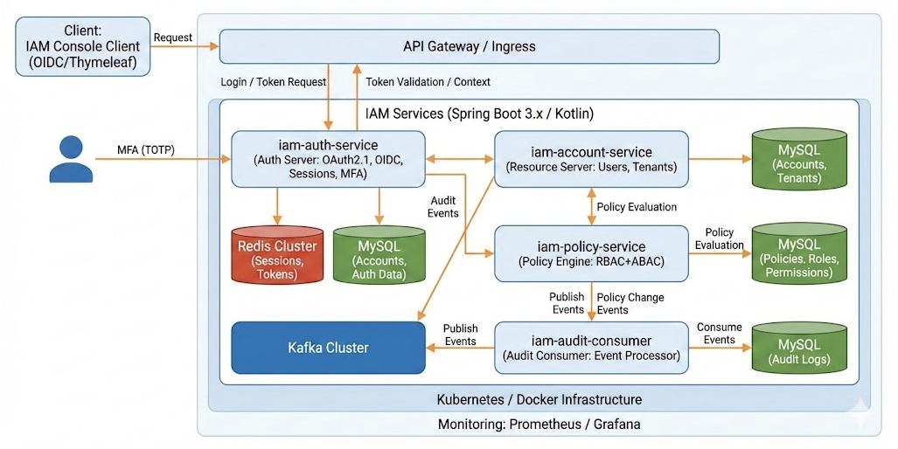

# CloudGate IAM (MiniCloud)

멀티테넌시 기반의 회원/계정 관리와 **OAuth2.1 / OIDC(Authorization Code + PKCE)** 인증 서버, **RBAC + ABAC** 정책 평가, **Redis 세션**, **Kafka 감사 이벤트**까지 “클라우드 IAM 백엔드”에서 다루는 핵심 문제를 작은 스케일로 설계·구현했습니다.

- 로컬 인프라(MySQL/Redis/Kafka): `docker/docker-compose.yml` / `docker/README.md`
- 부하 테스트(k6): `infra/perf/README.md`
- K8s 모니터링(Prometheus/Grafana) 매니페스트: `infra/k8s/monitoring.yaml`



---

## 구성(멀티 모듈 · 멀티 애플리케이션)

| 모듈 | 설명 | 기본 포트(로컬) |
| --- | --- | --- |
| `iam-auth-service` | Authorization Server(IdP). 세션 로그인(`/auth/login`), OIDC 메타데이터/토큰, MFA(TOTP), 감사 이벤트 발행 | `8080` |
| `iam-account-service` | Resource Server 샘플. Access Token 검증 및 사용자 컨텍스트 조회 | `8081` |
| `iam-policy-service` | RBAC/ABAC 정책 엔진(평가/변경 서비스 + Kafka 정책 이벤트 발행) | *(미지정: 로컬 실행 시 `SERVER_PORT` 권장)* |
| `iam-audit-consumer` | Kafka 감사 이벤트 소비 후 Audit DB 적재 | *(미지정: 로컬 실행 시 `SERVER_PORT` 권장)* |
| `iam-console-client` | OIDC Client(Thymeleaf). 로그인 후 ID Token 클레임 확인 | `3000` |
| `iam-common` | 멀티테넌시 Hibernate 필터/공통 도메인/이벤트 모델 | - |

> 참고: `iam-policy-service`, `iam-audit-consumer`는 `application.yml`에 `server.port`가 없어 기본값(`8080`)으로 실행됩니다. 로컬에서 여러 서비스를 동시에 띄울 때는 `SERVER_PORT`(또는 `--server.port`)로 포트를 분리하세요.

---

## 핵심 구현 포인트(요약)

- **멀티테넌시(Row-level)**: `tenant_id` 기반 Hibernate Filter + `TenantContextHolder`로 트랜잭션 경계에서 자동 적용 (`iam-common`)
- **세션 기반 인증**: Spring Security + Spring Session(Redis)로 분산 세션 구성 (`iam-auth-service`)
- **OAuth2.1 / OIDC**: Spring Authorization Server로 메타데이터/토큰 엔드포인트 제공, Authorization Code + PKCE 지원 (`iam-auth-service`)
- **MFA(TOTP)**: 등록/활성화/검증 API 제공, MFA 상태를 세션(SecurityContext)에 반영 (`iam-auth-service`)
- **RBAC + ABAC**: 역할/권한(RBAC) 1차 필터 후 ABAC DSL(JSON) 조건 트리 평가 (`iam-policy-service`)
- **감사 이벤트 파이프라인**: 로그인/정책 변경 이벤트를 Kafka 토픽으로 발행 → Consumer에서 MySQL 적재 (`iam-auth-service`, `iam-policy-service`, `iam-audit-consumer`)
- **관측성**: Actuator + Prometheus 메트릭 노출, K8s에서 Prometheus/Grafana 스크랩 구성 (`infra/k8s`)

---

## 로컬 실행(개발용)

### 1) 인프라(MySQL/Redis/Kafka) 기동

```bash
docker compose -f docker/docker-compose.yml up -d
```

기본 값(로컬 개발용):
- MySQL: `localhost:3306` / DB `cloudgate_iam` / `cloudgate` / `cloudgate-pass`
- Redis: `localhost:6379`
- Kafka: `localhost:9092`

### 2) 애플리케이션 기동

여러 서비스를 동시에 실행할 때는 포트 충돌을 피하기 위해 `SERVER_PORT`를 명시하는 방식을 권장합니다.

```bash
# 1) Authorization Server (기본 8080)
./gradlew :iam-auth-service:bootRun

# 2) Resource Server 샘플 (8081)
./gradlew :iam-account-service:bootRun

# 3) OIDC 콘솔 클라이언트 (3000)
./gradlew :iam-console-client:bootRun

# 4) 정책 서비스/감사 컨슈머 (예시 포트)
SERVER_PORT=8082 ./gradlew :iam-policy-service:bootRun
SERVER_PORT=8083 ./gradlew :iam-audit-consumer:bootRun
```

> `iam-policy-service`는 현재 `application.yml`에 DB 접속 정보(`spring.datasource.*`)가 포함되어 있지 않으므로 로컬 실행 시 환경 변수로 주입이 필요합니다.
>
> ```bash
> SERVER_PORT=8082 \
> SPRING_DATASOURCE_URL='jdbc:mysql://localhost:3306/cloudgate_iam?useSSL=false&characterEncoding=UTF-8&serverTimezone=UTC' \
> SPRING_DATASOURCE_USERNAME=cloudgate \
> SPRING_DATASOURCE_PASSWORD=cloudgate-pass \
> ./gradlew :iam-policy-service:bootRun
> ```

### 3) DB 스키마 주의 사항

현재 일부 서비스는 `spring.jpa.hibernate.ddl-auto: none`으로 설정되어 있어(예: `iam-auth-service`, `iam-account-service`) **사전 스키마 준비가 필요**합니다.  
로컬에서 빠른 구동이 필요하다면, 실행 시점에만 아래처럼 오버라이드할 수 있습니다.

```bash
# 로컬 개발 편의용(운영에서는 마이그레이션 도구(Flyway/Liquibase) 사용 권장)
SPRING_JPA_HIBERNATE_DDL_AUTO=update ./gradlew :iam-auth-service:bootRun
```

---

## 빠른 동작 확인(예시)

### 세션 로그인

```bash
curl -i -X POST http://localhost:8080/auth/login \
  -H 'Content-Type: application/json' \
  -d '{"tenantId":1,"username":"demo-user","password":"demo-password"}'

# 세션 쿠키를 포함해 현재 사용자 확인
curl -i http://localhost:8080/auth/me \
  -H 'Cookie: CGIAMSESSION=<응답 쿠키 값>'
```

### MFA(TOTP)

```bash
# (1) 등록 시작: secret + provisioningUri 반환
curl -i -X POST http://localhost:8080/auth/mfa/totp/setup \
  -H 'Cookie: CGIAMSESSION=<세션 쿠키>'

# (2) 활성화/검증
curl -i -X POST http://localhost:8080/auth/mfa/totp/activate \
  -H 'Content-Type: application/json' \
  -H 'Cookie: CGIAMSESSION=<세션 쿠키>' \
  -d '{"code":"123456"}'
```

### OIDC SSO(콘솔 클라이언트)

- 콘솔: `http://localhost:3000`
- 로그인 시작 URL: `http://localhost:3000/oauth2/authorization/minicloud`
- Authorization Server Issuer(기본): `http://localhost:8080`

---

## 메트릭/모니터링

- 각 서비스 메트릭: `GET /actuator/prometheus`
- K8s에서 Prometheus/Grafana 구성: `infra/k8s/monitoring.yaml`, `infra/k8s/ingress-monitoring.yaml`

---

## 부하 테스트(k6)

세션 로그인(`/auth/login`) 부하 시나리오와 실행 가이드는 `infra/perf/README.md`를 참고하세요.